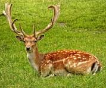
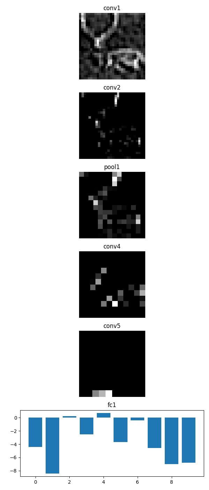

# Depthwise-separable-convolution
Depthwise separable convolution from scratch.
You can find the implementation of same code using normal convolution here. 'https://github.com/Marshajennifer/Visualise-CNN-layer-outputs'

# Dataset
We are using CIFAR10 dataset which consists of 10 classes which are 'plane', 'car', 'bird', 'cat', 'deer', 'dog', 'frog', 'horse', 'ship', 'truck'.
No need to download dataset
as we are loading dataset in the code using 
```
from torchvision.datasets import CIFAR10
```

# Visualise-CNN-layer-outputs
To visualize the outputs of each layer when passing an input image through layers.
This is the input image that we are giving to the model.
<p align="center">

</p>

And the visualization output is saved with filename "output_visualization.png" in the current directory
The visualization after passing through each of the layers looks like:
<p align="center">

</p>

In visualization we can see the graph have high value at 5th position which is deer.

